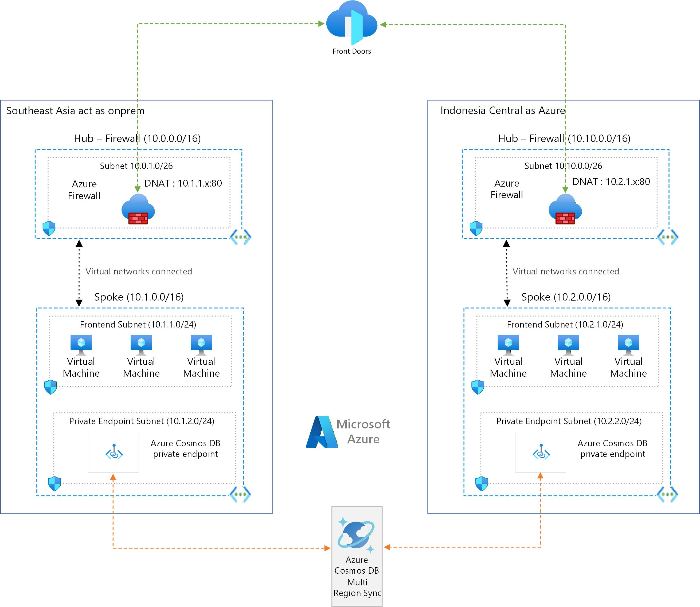

# Azure Resiliency Workshop

A hands-on workshop demonstrating multi-region resiliency patterns using Azure services with a Hub-Spoke network topology.

## 🎯 Purpose

This workshop provides a practical demonstration of building resilient, multi-region applications on Azure. Participants will deploy a complete infrastructure that showcases:

- **High Availability** - Applications remain accessible during regional failures
- **Disaster Recovery** - Automatic failover with minimal data loss
- **Network Security** - Enterprise-grade security with Azure Firewall and Private Endpoints
- **Global Load Balancing** - Seamless traffic distribution with Azure Front Door

## 📋 Scenario

### Business Context

A social media company called **"ConnectSEA"** is launching a new platform that allows users to:
- **Share posts and updates** with friends and followers
- **Upload and view photos** in a social feed
- **Like and comment** on posts in real-time
- **Follow other users** and build their social network

The platform needs to be deployed across multiple regions to:
- Ensure 99.99% uptime for their users in Southeast Asia
- Protect against regional Azure outages
- Meet compliance requirements for data residency
- Provide low-latency access for users in different geographic locations

### The Application

The ConnectSEA social media application features:
- **Node.js/Express.js** backend with EJS templating
- **Azure SQL Database** for storing user posts and interactions
- **Real-time feed** displaying the latest posts from all users
- **Health monitoring** endpoint for load balancer probes
- **Region-aware** responses showing which datacenter is serving the request

### Technical Challenge

Deploy a Node.js application across two Azure regions (Southeast Asia and Indonesia Central) with:
- Automatic failover when the primary region fails
- Data replication with near-zero RPO (Recovery Point Objective)
- Secure private connectivity to Azure SQL Database
- Centralized traffic management through Azure Firewall

## 🏗️ Architecture



## 🧩 Components

### Network Layer

| Component | Purpose | Configuration |
|-----------|---------|---------------|
| **Hub VNets** (×2) | Centralized network services | 10.0.0.0/16 (SEA), 10.10.0.0/16 (IDC) |
| **Spoke VNets** (×2) | Application workloads | 10.1.0.0/16 (SEA), 10.2.0.0/16 (IDC) |
| **VNet Peering** | Hub-Spoke connectivity | Bidirectional with traffic forwarding |
| **Route Tables** | Force traffic through Firewall | 0.0.0.0/0 → Firewall private IP |
| **NSGs** | Network security | Allow HTTP/HTTPS from Firewall subnet |

### Security Layer

| Component | Purpose | Configuration |
|-----------|---------|---------------|
| **Azure Firewall** (×2) | Centralized security, NAT | Basic SKU with DNAT rules |
| **Private Endpoints** (×2) | Private SQL connectivity | In PE subnets of each Spoke |
| **Private DNS Zone** | DNS resolution for PE | `privatelink.database.windows.net` |

### Application Layer

| Component | Purpose | Configuration |
|-----------|---------|---------------|
| **Ubuntu VMs** (×2) | Application hosting | Standard_B2s, no public IP |
| **Node.js App** | Social media demo app | Express.js, PM2, Nginx |
| **Azure Front Door** | Global load balancing | Priority-based routing |

### Data Layer

| Component | Purpose | Configuration |
|-----------|---------|---------------|
| **Azure SQL Servers** (×2) | Database hosting | General Purpose, Gen5, 2 vCores |
| **Failover Group** | Geo-replication & failover | Automatic failover, 60-min grace |
| **Database** | Application data | `resiliency-db` |

## 🎯 Goals and Objectives

### Learning Objectives

By completing this workshop, participants will be able to:

1. **Design Multi-Region Architectures**
   - Understand Hub-Spoke network topology
   - Configure VNet peering with proper traffic forwarding
   - Implement User-Defined Routes (UDR) for traffic control

2. **Implement Network Security**
   - Deploy Azure Firewall with DNAT rules
   - Configure Private Endpoints for Azure PaaS services
   - Set up Private DNS Zones for name resolution

3. **Build Resilient Data Layers**
   - Configure Azure SQL Failover Groups
   - Understand geo-replication and automatic failover
   - Work with Failover Group listener endpoints

4. **Enable Global Load Balancing**
   - Deploy Azure Front Door
   - Configure priority-based routing
   - Understand health probes and failover behavior

5. **Practice Disaster Recovery**
   - Simulate regional failures
   - Observe automatic failover in action
   - Verify data consistency after failover

### Success Criteria

✅ Deploy complete infrastructure across 5 resource groups  
✅ VMs accessible only through Azure Firewall (no public IPs)  
✅ SQL connectivity via Private Endpoints (public access disabled)  
✅ Application loads via Azure Front Door URL  
✅ Data replicates between regions in < 5 seconds  
✅ Automatic failover when primary region fails  
✅ Traffic returns to primary when restored  

## 📁 Project Structure

```
Resiliency/
├── README.md                  # This file
├── DEPLOYMENT_GUIDE.md        # Step-by-step deployment instructions
├── WORKSHOP_TASKS.md          # Workshop task checklist
├── app/                       # Node.js application
│   ├── package.json
│   ├── app.js
│   ├── .env.example
│   └── views/
│       └── index.ejs
└── scripts/                   # Deployment scripts
    ├── 01-deploy-infrastructure.sh
    ├── 02-deploy-app.sh
    ├── 03-demo-helper.sh
    └── 04-cleanup.sh
```

## 🚀 Quick Start

### Prerequisites

- Azure subscription with Contributor access
- Azure CLI installed and logged in (`az login`)
- Bash shell (WSL, Linux, macOS, or Azure Cloud Shell)

### Deployment

```bash
# 1. Clone or navigate to the workshop folder
cd Resiliency/scripts

# 2. Deploy infrastructure (~30 minutes)
chmod +x *.sh
./01-deploy-infrastructure.sh

# 3. Wait for VMs to initialize (5-10 minutes)
# 4. Deploy application (~5 minutes)
./02-deploy-app.sh

# 5. Access your application
# URL will be displayed in deployment output
```

### Cleanup

```bash
./04-cleanup.sh
```

## 💰 Estimated Costs

| Resource | SKU | Est. Cost/Hour |
|----------|-----|----------------|
| VMs (×2) | Standard_B2s | ~$0.10 |
| Azure Firewall (×2) | Basic | ~$0.50 |
| Azure SQL (×2) | General Purpose | ~$0.04 |
| Front Door | Standard | ~$0.05 |
| Networking | - | ~$0.05 |
| **Total** | | **~$0.75/hr** |

⚠️ **Important:** Delete all resources after the workshop to avoid ongoing charges!

## 📚 Additional Resources

- [Azure Well-Architected Framework - Reliability](https://learn.microsoft.com/azure/well-architected/reliability/)
- [Azure SQL Failover Groups](https://learn.microsoft.com/azure/azure-sql/database/failover-group-overview)
- [Hub-Spoke Network Topology](https://learn.microsoft.com/azure/architecture/reference-architectures/hybrid-networking/hub-spoke)
- [Azure Private Endpoints](https://learn.microsoft.com/azure/private-link/private-endpoint-overview)
- [Azure Front Door](https://learn.microsoft.com/azure/frontdoor/front-door-overview)

## 🤝 Contributing

Contributions are welcome! Please submit issues or pull requests for improvements.

## 📝 License

This workshop is provided for educational purposes.

---

**Workshop Duration:** 2-3 hours  
**Difficulty Level:** Intermediate  
**Target Audience:** Cloud architects, DevOps engineers, Azure administrators
